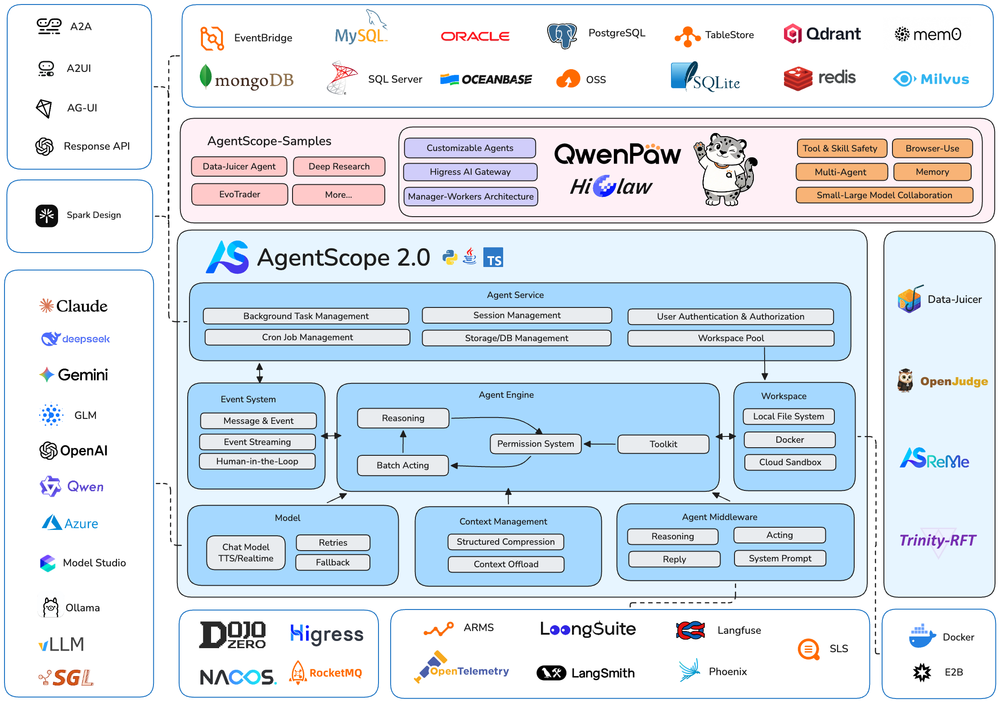

<p align="center">
  
</p>

<span align="center">

[**中文主页**](https://github.com/agentscope-ai/agentscope-java/blob/main/README_zh.md) | [**Documentation**](https://java.agentscope.io/)

</span>

<p align="center">
    <a href="https://discord.gg/eYMpfnkG8h">
        
    </a>
    <a href="https://java.agentscope.io/">
        
    </a>
    <a href="https://img.shields.io/maven-central/v/io.agentscope/agentscope">
        
    </a>
    <a href="#">
        
    </a>
    <a href="./LICENSE">
        
    </a>
    <a href="https://deepwiki.com/agentscope-ai/agentscope-java">
        
    </a>
</p>

## What is AgentScope Java 2.0?

AgentScope Java 2.0 is a production-ready framework for building distributed, enterprise-grade agents, providing essential abstractions that work with rising model capability and built-in support for long-running, safely-controlled agent execution.

- [**Event System** →](https://java.agentscope.io/v2/en/docs/building-blocks/message-and-event.html) A unified event stream with 28 typed events for real-time frontend rendering and human-in-the-loop.
- [**Permission System** →](https://java.agentscope.io/v2/en/docs/building-blocks/permission-system.html) Tool-call gating: allow / require user approval / deny.
- [**Middleware** →](https://java.agentscope.io/v2/en/docs/building-blocks/middleware.html) AOP-style hook interception for flexibly extending the reasoning-acting loop.
- [**Workspace & Sandbox** →](https://java.agentscope.io/v2/en/docs/harness/workspace.html) Run tools in isolated environments — local, Docker, Kubernetes, or AgentRun cloud sandbox.
- [**Multi-Agent Orchestration** →](https://java.agentscope.io/v2/en/docs/harness/subagent.html) Multiple subagent definition patterns with `agent_spawn` / `agent_send` and real-time event forwarding.
- [**Distributed Deployment** →](https://java.agentscope.io/v2/en/docs/others/going-to-production.html) True distributed session and memory management (Redis / MySQL / PostgreSQL / OSS / COS) with cross-replica session recovery.



## News
<!-- BEGIN NEWS -->
- **[2026-07] `v2.0.0 GA`:** First production-ready release! Dual-layer agent architecture, event stream, permission system, middleware, workspace sandbox, multi-agent orchestration, and distributed deployment all ready. [Docs](https://java.agentscope.io/) | [Release Notes](https://github.com/agentscope-ai/agentscope-java/releases/tag/v2.0.0)
- **[2026-07] `v2.0.0-RC5`:** Model provider modularization; unified DataBlock multimodal support; native structured output; Channel IM integration; Tencent Cloud COS state persistence. [Release Notes](https://github.com/agentscope-ai/agentscope-java/releases/tag/v2.0.0-RC5)
- **[2026-06] `v2.0.0-RC4`:** Async tool execution and scheduled wakeup dispatching; subagent cross-replica routing and session recovery. [Release Notes](https://github.com/agentscope-ai/agentscope-java/releases/tag/v2.0.0-RC4)
- **[2026-06] `v2.0.0-RC3`:** Unified `call()` / `streamEvents()` execution core; `AgentResultEvent`, `CustomEvent`, `HintBlockEvent` new event types. [Release Notes](https://github.com/agentscope-ai/agentscope-java/releases/tag/v2.0.0-RC3)
- **[2026-06] `v2.0.0-RC2`:** Fully stateless agent; one-line DistributedBackend; subagent event forwarding; Channel module (DingTalk, Feishu, WeCom); A2A / AG-UI protocol support. [Release Notes](https://github.com/agentscope-ai/agentscope-java/releases/tag/v2.0.0-RC2)
- **[2026-05] `v2.0.0-RC1`:** First 2.0 RC — harness engineering, enterprise distributed deployment, event stream / message model / middleware / HITL full redesign. [Release Notes](https://github.com/agentscope-ai/agentscope-java/releases/tag/v2.0.0-RC1)
- **[2026-05] `v1.1.0`:** Introduced `agentscope-harness` and `HarnessAgent`; Workspace (persona / memory / skills / subagents); pluggable filesystem (local / shared store / sandbox); session persistence with cross-process resume; layered memory and context compaction; declarative subagent orchestration. [Release Notes](https://github.com/agentscope-ai/agentscope-java/releases/tag/v1.1.0-RC1)
<!-- END NEWS -->

## Community

Welcome to join our community on

| [Discord](https://discord.gg/eYMpfnkG8h)                     | DingTalk                                                              | WeChat                                                       |
|--------------------------------------------------------------|-----------------------------------------------------------------------|--------------------------------------------------------------|
|  |  |  |

## Quickstart

### Installation

> AgentScope Java requires **JDK 17** or higher.

#### Maven

```xml
<dependency>
    <groupId>io.agentscope</groupId>
    <artifactId>agentscope-harness</artifactId>
    <version>2.0.0</version>
</dependency>
```

Model providers are shipped as separate extension modules in 2.0. Add the one you need — for example, DashScope:

```xml
<dependency>
    <groupId>io.agentscope</groupId>
    <artifactId>agentscope-extensions-model-dashscope</artifactId>
    <version>2.0.0</version>
</dependency>
```

Other options: `agentscope-extensions-model-openai`, `agentscope-extensions-model-anthropic`, `agentscope-extensions-model-gemini`, `agentscope-extensions-model-ollama`. See the [Model docs](https://java.agentscope.io/v2/en/docs/building-blocks/model.html) for details.

If you only need a bare `ReActAgent` without workspace / persistence / sandbox, depend on `agentscope-core` alone.

## Hello AgentScope!

Start your first agent with AgentScope Java 2.0:

```java
import io.agentscope.core.agent.RuntimeContext;
import io.agentscope.core.message.UserMessage;
import io.agentscope.harness.agent.HarnessAgent;
import java.nio.file.Paths;

public class FirstAgent {
    public static void main(String[] args) {
        HarnessAgent agent = HarnessAgent.builder()
                .name("assistant")
                .sysPrompt("You are a helpful AI assistant.")
                // ModelRegistry resolves the string and reads the matching
                // API-key env var (e.g. OPENAI_API_KEY) automatically.
                // Examples: "openai:gpt-4.1", "openai:o3",
                // "deepseek:deepseek-chat", "dashscope:qwen-plus",
                // "anthropic:claude-sonnet-4-7", "ollama:llama3"
                .model("dashscope:qwen-plus")
                // Or pass a ChatModel object directly:
                // .model(OpenAIChatModel.builder().model("gpt-4.1").build())
                .workspace(Paths.get(".agentscope/workspace"))
                .build();

        RuntimeContext ctx = RuntimeContext.builder()
                .sessionId("demo").userId("alice").build();

        // Blocking call
        agent.call(new UserMessage("Hello!"), ctx).block();

        // Or stream events for real-time UI rendering
        agent.streamEvents(new UserMessage("Summarize today in three bullets."), ctx)
                .doOnNext(event -> {
                    switch (event.getType()) {
                        case TEXT_BLOCK_DELTA -> System.out.print(
                                ((io.agentscope.core.event.TextBlockDeltaEvent) event).getDelta());
                        case TOOL_CALL_START -> System.out.println(
                                "\n[tool] " + ((io.agentscope.core.event.ToolCallStartEvent) event).getToolCallName());
                        default -> { }
                    }
                })
                .blockLast();
    }
}
```

## Key Design

AgentScope Java 2.0 is a major step up from a "build an agent" toolkit toward a complete platform for **running agents in production**. The improvements fall into three focus areas:

### 1 · Harness Engineering — built for long-running, complex tasks

A bare ReAct loop solves one reasoning turn. **HarnessAgent** layers engineering infrastructure on top of ReActAgent via Middleware and Toolkit channels — the reasoning core stays untouched, capabilities layer on:

- **Self-evolution & skill repository** — successful patterns auto-save as Markdown skills, shared across sessions and loaded on demand
- **Layered memory** — in-context conversation + agent-curated `MEMORY.md` + on-disk fact log, with auto-compaction to bound the prompt
- **Sub-agents** — declare child agent specs in Markdown, `agent_spawn` / `agent_send` at runtime, sync or background delegation
- **Auto context management** — structured compaction preserves goals / state / findings / next steps; oversized tool results offload to disk
- **Plan Mode** — read-only planning state for long tasks, plan files persist and drive execution

### 2 · Enterprise-grade distributed deployment

Production agents must serve many tenants, run untrusted code safely, and survive rolling restarts. AgentScope 2.0 is built for stateless horizontal scaling:

- **Multi-tenant isolation** — `session` / `user` / `agent` / `org` dimension isolation, `RuntimeContext` keys flow through workspace paths, KV namespaces, and sandbox state slots
- **Secure sandbox** — local subprocess / Docker / Kubernetes / E2B cloud sandbox, with snapshot and resume
- **Permission control** — three-state engine (allow / approve / deny), sensitive tools require HITL approval
- **Session recovery** — `AgentStateStore` (in-memory / JSON file / MySQL / Redis / PostgreSQL) backs zero-downtime rolling deploys

### 3 · Foundation framework — a leaner, more developer-friendly core

Messages, events, and the extension model are smaller, more orthogonal — HITL and event streaming are part of how the framework runs, not add-ons:

- **Event stream** — 28 typed events covering model calls, text deltas, tool execution, and user confirmations in real time
- **Message model** — text / files / images / audio / video / tool results unified into `ContentBlock`, role-strict validation at construction
- **Middleware** — `onAgent` / `onReasoning` / `onActing` / `onModelCall` / `onSystemPrompt` five stages replace v1's flat hooks
- **HITL first class** — confirm tool arguments, approve sensitive actions, hand off to external systems, agent pauses and resumes exactly

For the complete architecture overview, see the [documentation](https://java.agentscope.io/v2/en/docs/index.html).

## Contributing

We welcome contributions from the community! Please refer to our [CONTRIBUTING.md](./CONTRIBUTING.md) for guidelines
on how to contribute.

## License

AgentScope is released under Apache License 2.0.

## Contributors

All thanks to our contributors:

<a href="https://github.com/agentscope-ai/agentscope-java/graphs/contributors">
  
</a>
